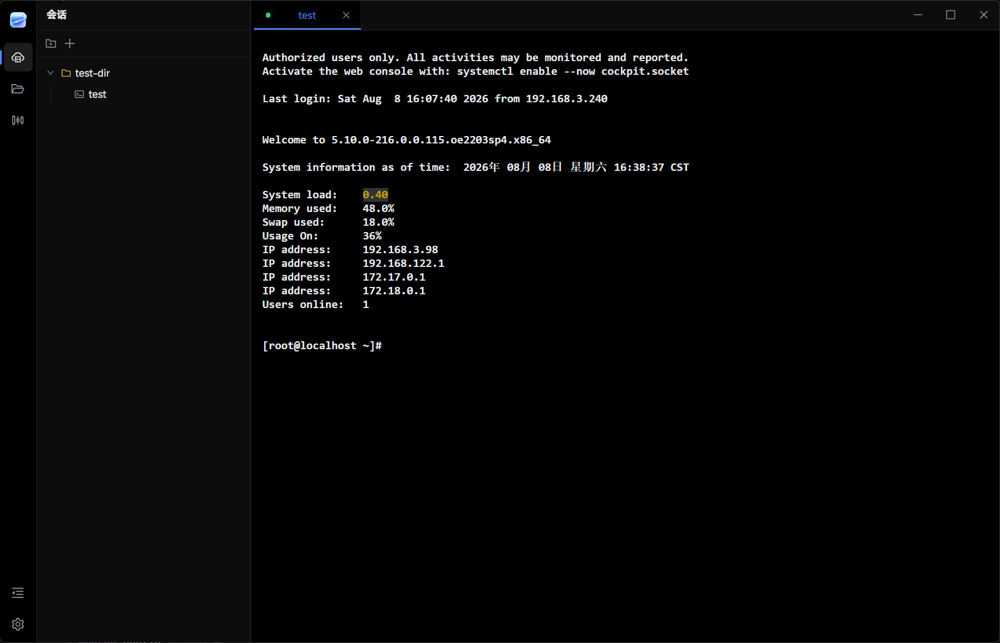

# Termio

[English](README.md) | [中文](README.zh-CN.md)

Termio 是一个本地 Windows SSH 客户端，把终端会话、SFTP 文件管理和远程系统状态集中在一个桌面应用中。

## 截图



## 功能

- 支持多个 SSH 终端标签页，也可以为同一个保存的会话建立多个连接。
- 支持会话文件夹和默认会话。
- 支持 SFTP 浏览、上传、下载、批量传输、拖拽及常用文件操作。
- 展示 CPU、内存、网络、磁盘以及受支持 GPU 的远程系统状态。
- 支持深色和浅色主题，默认使用深色模式。
- 会话和设置保存在本地；选择记住密码时，密码由操作系统凭据存储保护。

## 快速开始

```bash
npm install
npm run dev
```

创建会话并填写服务器地址和凭据，然后从会话列表打开。通过左侧栏切换会话、SFTP 和系统状态，设置入口位于左下角。

## 设置

- 深色或浅色主题
- 界面字号
- 终端字体和字号
- 光标样式、闪烁和竖线宽度
- 选中内容后自动复制和右键粘贴
- 多行粘贴确认
- 默认下载目录
- 单实例运行
- 可选的英文输入法切换
- 侧边栏显示状态和宽度
- 隐藏文件显示

界面固定使用内置 MiSans 字体。终端背景、默认文字和光标颜色跟随主题切换，命令输出的 ANSI 特殊颜色保持不变。

## 运行时数据

开发模式的数据保存在项目目录中；打包后的数据保存在 `Termio.exe` 旁边：

```text
data/app.db
data/user-data/window-state.json
```

旧版本存放在运行目录根部的数据会在首次启动时自动迁移到 `data/`。

## 开发

```bash
npm run verify
npm run build
```

创建 Windows unpacked 包：

```bash
npm run pack:unpacked
```

输出：

```text
release/Termio/Termio.exe
```

## 许可证

MIT，详见 [LICENSE](LICENSE)。
